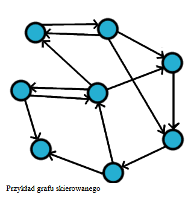

## Raid
- najmniej bezpieczny jest RAID 0
- rozmiar RAID 10 liczy się tak:

$$\frac{rozmiarNajmniejszego * liczbaDysków}{{2}}$$

rozmiar RAID 5:
$$rozmiarNajmniejszego * (liczbaDysków - 1)$$

## Autoryzacja autentykacja
1. autentykacja to sprawdzenie czy użytkownik jest tym za kogo się podaje np login i hasło

2. autoryzacja prawa do pewnych czynności jak już jesteś zalogowany. np zwykły user ma mniejsze prawa niż admin

## dequeue()
usuwa głowę

## DTD
Document Type Definition

## Limes
$$\lim_{{x \to 1^+}} \frac{1}{{(1-x^2)^3}} = -\infty$$
ponieważ jest wtedy 
$$\frac{1}{{(1-1)^3}}$$

a że zmierza z prawej strony czyli z większego od 1 to jest minus nieskończoność

## Sortowanie
### Stabilne

Elementy o równej wartości będą występowały, po posortowaniu, w takiej samej kolejności jaką miały w zbiorze nieposortowanym.

- sortowanie bąbelkowe (ang. bubblesort) – \(O(n^2)\)
- sortowanie przez wstawianie (ang. insertion sort) – \(O(n^2)\)
- sortowanie przez scalanie (ang. merge sort) – \(O(n \log n)\), wymaga \(O(n)\) dodatkowej pamięci
- sortowanie przez zliczanie (ang. counting sort lub count sort) – \(O(n + k)\), wymaga \(O(n + k)\) dodatkowej pamięci
- sortowanie kubełkowe (ang. bucket sort) – \(O(n^2)\), wymaga \(O(k)\) dodatkowej pamięci
- sortowanie pozycyjne (ang. radix sort) – \(O(d(n + k))\), gdzie \(k\) to wielkość domeny cyfr, a \(d\) szerokość kluczy w cyfrach. Wymaga \(O(n + k)\) dodatkowej pamięci
- sortowanie biblioteczne (ang. library sort) – \(O(n \log n)\), pesymistyczny \(O(n^2)\)

## Niestabilne

- sortowanie przez wybieranie (ang. selection sort) – \(O(n^2)\), może być stabilne po odpowiednich zmianach
- sortowanie Shella – (ang. shellsort), złożoność nieznana
- sortowanie grzebieniowe – (ang. combsort), optymistyczny \(O(n \log n)\), pesymistyczny \(O(n^2)\)
- sortowanie szybkie – (ang. quicksort), \(O(n \log n)\), pesymistyczny \(O(n^2)\)
- sortowanie introspektywne – (ang. introspective sort lub introsort), \(O(n \log n)\)
- sortowanie przez kopcowanie – (ang. heapsort), \(O(n \log n)\)


### Kody

#### `Na pewn były kody na sortowanie przez wstawianie i przez wybieranie`

Sortowanie bąbelkowe (Bubble sort) - porównuje sąsiednie elementy i zamienia je miejscami, aż największy element "wypłynie" na koniec.
```C
// Funkcja pomocnicza do zamiany elementów
void swap(int *a, int *b) {
    int temp = *a;
    *a = *b;
    *b = temp;
}

// 1. Sortowanie bąbelkowe (Bubble Sort)
void bubbleSort(int arr[], int n) {
    for (int i = 0; i < n - 1; i++) {
        for (int j = 0; j < n - i - 1; j++) {
            if (arr[j] > arr[j + 1]) {
                swap(&arr[j], &arr[j + 1]);
            }
        }
    }
}
```
Sortowanie przez wstawianie (Insertion Sort) - wstawia kolejne elementy w odpowiednie miejsce w już posortowanej części tablicy.
```C
// 2. Sortowanie przez wstawianie (Insertion Sort)
void insertionSort(int arr[], int n) {
    for (int i = 1; i < n; i++) {
        int key = arr[i];
        int j = i - 1;
        while (j >= 0 && arr[j] > key) {
            arr[j + 1] = arr[j];
            j--;
        }
        arr[j + 1] = key;
    }
}
```
Selection Sort – wybiera najmniejszy element i zamienia go z pierwszym nieposortowanym elementem.
```C
// 3. Sortowanie przez wybór (Selection Sort)
void selectionSort(int arr[], int n) {
    for (int i = 0; i < n - 1; i++) {
        int minIndex = i;
        for (int j = i + 1; j < n; j++) {
            if (arr[j] < arr[minIndex]) {
                minIndex = j;
            }
        }
        swap(&arr[i], &arr[minIndex]);
    }
}
```
Quick Sort – wybiera pivot, dzieli tablicę na mniejsze części i sortuje rekurencyjnie.
```C
// 4. Sortowanie szybkie (Quick Sort)
int partition(int arr[], int low, int high) {
    int pivot = arr[high];
    int i = low - 1;
    for (int j = low; j < high; j++) {
        if (arr[j] < pivot) {
            i++;
            swap(&arr[i], &arr[j]);
        }
    }
    swap(&arr[i + 1], &arr[high]);
    return i + 1;
}
void quickSort(int arr[], int low, int high) {
    if (low < high) {
        int pi = partition(arr, low, high);
        quickSort(arr, low, pi - 1);
        quickSort(arr, pi + 1, high);
    }
}
```
Merge Sort – dzieli tablicę na pół, sortuje każdą część osobno i scala wyniki.
```C
// 5. Sortowanie przez scalanie (Merge Sort)
void merge(int arr[], int left, int mid, int right) {
    int n1 = mid - left + 1;
    int n2 = right - mid;
    int L[n1], R[n2];
    for (int i = 0; i < n1; i++) L[i] = arr[left + i];
    for (int i = 0; i < n2; i++) R[i] = arr[mid + 1 + i];
    int i = 0, j = 0, k = left;
    while (i < n1 && j < n2) {
        if (L[i] <= R[j]) arr[k++] = L[i++];
        else arr[k++] = R[j++];
    }
    while (i < n1) arr[k++] = L[i++];
    while (j < n2) arr[k++] = R[j++];
}
void mergeSort(int arr[], int left, int right) {
    if (left < right) {
        int mid = left + (right - left) / 2;
        mergeSort(arr, left, mid);
        mergeSort(arr, mid + 1, right);
        merge(arr, left, mid, right);
    }
}
```

## Algorytm Bellmana-Forda
Algorytm Bellmana-Forda służy do znajdowania najkrótszych ścieżek z jednego wierzchołka do wszystkich innych w grafie z wagami, które mogą być zarówno dodatnie, jak i ujemne. Jest wolniejszy niż algorytm Dijkstry, ale może wykrywać cykle ujemnej wagi, co czyni go użytecznym w przypadku grafów, gdzie mogą one występować.

## CSS grupa elementów
czyli dopowiedź to przecinek `,`

- ` ` Spacja - elementy potomne, np. div p (wszystkie p w divach)
- `,` Przecinek - jak chcemy do kilku, np h1, h2, h3 odniesie się tylko do stylów tych trzech
- `+` Plus - element, który następuje po nim, (h1 + p, to pierwsze p po h1)
- `;` Średnik - oddzielenie wartości w stylach
- `>` każdy bezpośredni potomek
## SQL trigger
są to procedury w sql wykonujące się przed lub po danej czynności np
- INSERT
- DELETE
- UPDATE

## Algorytm do znajdowania trasy w labiryncie przez robota
i tu jest problem bo nie wiadomo

kiedyś chat mi powiedział, że DFS – Depth-First Search jest używany do szukania wyjścia z labiryntu więc może to


Możliwe że było o najkrótszą dorgę to wtedy Dijsktra jest

### W bazie chyba jest BFS (wszerz)
## Łazik marsjański
VXWorks

## ile jest rozwiązań dla F(x) = 1

$$
f(x) =
\begin{cases} 
x - 2 & \text{dla } x \leq 0 \\
|x + 3| & \text{dla } x > 0
\end{cases}
$$


Przeanalizujemy osobno każdą część układu równań.

### 1. Część dla  x <= 0 
Równanie:

$$
x - 2 = 1
$$

Rozwiązanie:

$$
x - 2 = 1 \\
x = 3
$$

Jednak to rozwiązanie nie jest w zakresie x <= 0 , więc nie ma rozwiązania w tej części.

### 2. Część dla \( x > 0 \)
Równanie:

$$
|x + 3| = 1
$$

Rozwiązanie:

To równanie ma dwa przypadki:

- \( x + 3 = 1 \)

$$
x + 3 = 1 \\
x = -2
$$

Jednak to rozwiązanie nie jest w zakresie \( x > 0 \), więc nie jest akceptowane.

- \( x + 3 = -1 \)

$$
x + 3 = -1 \\
x = -4
$$

Jednak to rozwiązanie także nie jest w zakresie \( x > 0 \), więc nie jest akceptowane.

### Podsumowanie:
Nie ma rozwiązania dla równania \( f(x) = 1 \) w podanym układzie równań. Funkcja \( f(x) \) nie przyjmuje wartości 1 w żadnym punkcie.

## Tworzenie partycji 30tb, 5tb i coś jeszcze
GPT

## Linux co robi -r w komendzie rm
usunie rekursywnie czyli katalog wraz z podkatalogami
```
rm -r katalog
```

## Czytelnicy i pisarze
tam dobrą odpowiedzią było jak są dwaj pisarze w czytelni (albo innymi słowami to było, że są dwa procesy zapisujące)

## Rozpoznanie protokołu na zrzucie ekranu z konfiguracji

Aby rozróżnić protokoły routingu, takie jak **RIPv1**, **RIPv2**, **OSPF**, w zrzucie ekranu z konfiguracji routera lub innej dokumentacji, zwróć uwagę na kilka charakterystycznych cech każdego z nich:

### 1. **RIP (Routing Information Protocol)**
   - **RIPv1**:
     - **Protokół klasyczny, bez wsparcia dla autentykacji.**
     - Używa klasycznego **adresowania w klasach A, B, C**.
     - Wysyła tylko **maksymalnie 15 skoków** jako miarę odległości.
     - **Brak wsparcia dla IPv6**.
     - W konfiguracji często zobaczysz coś w rodzaju:
       ```bash
       router rip
       version 1
       network [adres]
       ```
   
   - **RIPv2**:
     - Wersja nowsza, obsługująca **autentykację** i **IPv6**.
     - Obsługuje **bardziej zaawansowane funkcje** w porównaniu do RIPv1, w tym transmisję informacji o routingu w formie multicast.
     - Jeśli w konfiguracji pojawia się `version 2` w komendzie RIP, to jest to **RIPv2**.
     - Często wygląda to tak:
       ```bash
       router rip
       version 2
       network [adres]
       ```

### 2. **OSPF (Open Shortest Path First)**
   - **Protokół link-state**. Jest to bardziej zaawansowany protokół routingu, używający **algorytmu SPF** (Shortest Path First).
   - OSPF jest używany głównie w **większych sieciach** i obsługuje **hierarchię z obszarami** (Area 0 to obszar „backbone”).
   - W konfiguracji routera można zobaczyć coś w rodzaju:
     ```bash
     router ospf [process-id]
     network [adres] [wildcard-mask] area [area-id]
     ```

### Jak rozpoznać w konfiguracji?

- Jeśli widzisz **`router rip`** z **`version 1` lub `version 2`**, to masz do czynienia z **RIP**.
- Jeśli widzisz **`router ospf`** oraz **`area`**, to jest to **OSPF**.
- RIP używa klasycznego podejścia do routingu (na przykład, w RIPu wysyłane są tablice routingu zawierające tylko informacje o liczbie skoków), natomiast OSPF jest bardziej skomplikowanym protokołem, który dzieli sieć na obszary i używa bardziej zaawansowanych mechanizmów, jak algorytmy stanu łączy.

### Cechy charakterystyczne:
- **RIP**:
  - Wersja 1 i 2.
  - Podstawowe routowanie z wykorzystaniem liczby skoków.
  - Wykorzystuje broadcast w RIPv1, a multicast w RIPv2.
  
- **OSPF**:
  - Protokół link-state.
  - Rozdziela sieć na obszary (Area 0 to obszar backbone).
  - Wymaga bardziej zaawansowanej konfiguracji.

## Maksymalna ilość przeskoków
- ogólnie w sieci IP to 255
- w protokole RIP 15

## Porty z Administracji WWW
- 443 HTTPS
- 25 SMTP
- 22 SSH

## Funkcja mapy ciepła w seaborn python
seaborn.heatmap()

## Ilościowy rozkład danych
histogram

## Metody ilościowe i jakościowe
### Metody ilościowe (Quantitative Methods)

Są to metody badawcze, które opierają się na liczbach i statystykach. Pozwalają na zbieranie danych, które można zmierzyć, skwantyfikować i przeanalizować matematycznie. Celem jest uzyskanie obiektywnych wyników, które są liczbowe i mogą być przekształcone w statystyki.

Przykłady metod ilościowych:

- Eksperymenty – np. badanie wpływu jednej zmiennej na drugą przy kontrolowaniu innych zmiennych.
- Ankiety z pytaniami zamkniętymi (np. skala Likerta, oceny od 1 do 5).
- Badania statystyczne – analiza danych liczbowych, np. średnie, mediany, regresja liniowa, testy hipotez.
- Modele matematyczne i prognozy – np. predykcja wartości na podstawie danych historycznych.

### Metody jakościowe (Qualitative Methods)

Są to metody badawcze, które koncentrują się na zrozumieniu i interpretacji zjawisk, a nie na liczbowych pomiarach. Celem jest głębsze zrozumienie tematów, idei, zachowań i procesów poprzez analizę tekstów, obrazów, wywiadów, czy obserwacji.

Przykłady metod jakościowych:

- Wywiady indywidualne – swobodne rozmowy, które pozwalają na uzyskanie szczegółowych informacji.
- Grupy fokusowe – dyskusje grupowe na temat określonego zagadnienia.
- Analiza treści – badanie tekstów, dokumentów, nagrań wideo lub audio w celu wyodrębnienia znaczeń, motywów i tematów.
- Obserwacja – badanie zjawisk w naturalnym kontekście, np. badanie zachowań konsumentów w sklepie.

## Data i czas w pandas Python

Aby utworzyć obiekt daty i czasu, Pandas wykorzystuje typ danych `datetime`.

```python
import pandas as pd

# Tworzenie obiektu datetime z konkretnej daty
data = pd.to_datetime('2025-02-05')

# Tworzenie obiektu datetime z listy dat
data_list = pd.to_datetime(['2025-02-05', '2024-12-25', '2023-11-18'])

print(data)
print(data_list)

```
## Kabel miedziany - zapobieganie przesłuchom
- skrętki
- ekranowanie
- Utrzymywanie odpowiednich odległości między przewodami
- Zastosowanie odpowiednich złączek
- Wysoka jakość kabli
- Zastosowanie odpowiednich częstotliwości
- Montaż w odpowiednich warunkach
- Odpowiednia długość kabla

## Matematyka 1 z grupy chłopców i dziewczyn wybieramy np tak jak w bazie czyli z 6 chłopców i 4 dziewczyny tak, żeby maksymalnie jedna dziewczyna była

C<sup>0</sup><sub>4</sub>*C<sup>3</sup><sub>6</sub> + C<sup>1</sup><sub>4</sub>*C<sup>2</sup><sub>6</sub>

## W jakich języka najczęściej roboty się piszę
Python i C++

## Copy running-config startup-config
Komenda copy running-config startup-config w systemach Cisco (np. w routerach i przełącznikach) jest używana do zapisania bieżącej konfiguracji (running configuration) do pamięci, która jest używana podczas uruchamiania urządzenia (startup configuration). Oznacza to, że jeśli urządzenie zostanie zrestartowane, konfiguracja zostanie wczytana z pamięci startowej i zastosowana podczas uruchamiania.

### Wyjaśnienie:

- running-config – to bieżąca konfiguracja urządzenia, która znajduje się w pamięci RAM. Jest to konfiguracja, którą urządzenie używa w danym momencie.
- startup-config – to konfiguracja przechowywana w pamięci NVRAM (non-volatile random access memory), która jest używana przy każdym uruchomieniu urządzenia.

## Java doPost(HttpServletRequest req, HttpServletResponse res)

`doPost(HttpServletRequest req, HttpServletResponse res)` służy do obsługi żądań HTTP wysyłanych metodą POST. Oto przykład implementacji serwletu, który pobiera dane z żądania i zwraca odpowiedź

## Router z RIPv2 co się stanie po komendzie `no version 2`
Jeśli na routerze korzystającym z RIPv2 wykonasz komendę `no version 2` to router powróci do RIPv1.

## Algorytmy theta, które jest prawdziwe
Pojęcie **Θ (theta)** w analizie asymptotycznej oznacza **ścisłą granicę wzrostu funkcji**.

Innymi słowy, **f(n) należy do Θ(g(n)), jeśli rośnie w tym samym tempie co g(n), z dokładnością do stałych współczynników.**  

---

Teraz przeanalizujmy każdą z podanych zależności:

1. **Θ(n⁴) dla n⁸**  
   - **Nieprawda** ❌  
   - \( n^8 \) rośnie znacznie szybciej niż \( n^4 \), więc nie można powiedzieć, że \( n^8 \) jest w Θ(n⁴).  

2. **Θ(n⁴) dla n⁴**  
   - **Prawda** ✅  
   - Funkcja \( n^4 \) rośnie dokładnie w tym samym tempie co \( n^4 \), więc jest w Θ(n⁴).  

3. **Θ(n²) dla n⁴**  
   - **Nieprawda** ❌  
   - \( n^4 \) rośnie szybciej niż \( n^2 \), więc nie można powiedzieć, że \( n^4 \) należy do Θ(n²).  

---

### **Podsumowanie:**
**Poprawna odpowiedź to: tylko jedna zależność jest prawdziwa, czyli**  
➡ **Θ(n⁴) gdy n⁴** ✅

## CSS - wszystkie linki w divie wykorzystujące pseudoklasę hover
`div a:hover`

## Grafy
http://student.krk.pl/026-Ciosek-Grybow/rodzaje.html

- nieskierowany - nie ma strzałek na połączeniach między węzłami
- skierowany - ma strzałki
- spójny - każdy wierzchołek jest jakkolwiek połączony, nie ma węzła który jest z boku
- niespójny - jak nie jest spójny
- pełny - każdy z każdym




### graf z literkami
a->b->d-> 

/ b->c->d/ 

b->c->d->e/

jest to graf acykliczny skierowany. Nie posiada cykli czyli nie można wrócić do żadnego wierzchołka podąrzając krawędziami

## Zasada Kerckhoffsa
bezpieczeństwo systemu kryptograficznego nie powinno zależeć od ukrywania jego algorytmu, lecz wyłącznie od tajności klucza.

## Metoda planowania
| Zadanie | Działanie | Min. czas | Max. czas |
|---------|-----------|-----------|-----------|
| A       | 50ms      | 40ms      | 80ms      |
| B       | 40ms      | 20ms      | 100ms     |
| C       | 60ms      | 30ms      | 80ms      |
| D       | 30ms      | 50ms      | 100ms     |

chyba coś tam z scheduling
do spradzenia

## Dodawanie kolumny do bazy danych

`ALTER TABLE nazwaTabeli ADD nazwaNowejKolumny Varchar(30)`
`ALTER TABLE nazwaTabeli ADD nazwaNowejKolumny INT`

## MVC
- Model - warstwa danych, odpowiada za logikę biznesową
- View - warstwa prezentacji, odpowiada za wyświetlanie danych
- Controller - warstwa sterowania, odpowiada za obsługę żądań użytkownika.

## Kolejka to tryb
FIFO - first in first out

## Kolejka z 5 elementami i są kroki. Ile elementów będzie w kolejce
5 elementów

kroki:
- enqueue - dodaje na koniec kolejki element `+1`
- enqueue - dodaje na koniec kolejki element `+1`
- dequeue - ściąga z początku kolejki element `-1`
- enqueue - dodaje na koniec kolejki element `+1`
- dequeue - ściąga z początku kolejki element `-1`

czyli na koniec będzie 6

## CSS position, które względem okna przeglądarki
- `fixed` - Element pozostaje w tym samym miejscu nawet podczas przewijania strony
- ewentualnie `absolute` też może być ustawiony względem okna, ale tylko jeśli jego rodzic nie ma position: `relative`;

### opis wszystkich position w razie czego
- `static` – domyślna pozycja elementów (zgodna z kolejnością w kodzie).
- `relative` – element pozostaje w normalnym układzie, ale można go przesunąć względem pierwotnej pozycji
- `absolute` – element jest pozycjonowany względem najbliższego rodzica z position: relative; lub względem `<html>`
- `fixed` – element jest przypięty do okna przeglądarki (nie przewija się)
- `sticky` – element zachowuje się jak relative, ale przy przewijaniu może się przykleić do ekranu

## Co potrzebuje obiekt w pythonie by być iterowalnym
musi implementować `__iter__()` oraz `__next__()`

## Python co się wyświetli

### Było dokładnie pytanie które zdanie jest prawdziwe i odowiedź była że każdy iterator jest iterowalny czy coś takiego

```python
a = [2, 3]
a.append([4, 5])
print(a)
```
wynik:
```bash
[2, 3, [4, 5]]
```
w pythonie listy mogą mieć różne typy w sobie, więc lista może zawierać zarówno inty jak i listę intów

## PCA
PCA (Principal Component Analysis) – Analiza Głównych Składowych

PCA to metoda redukcji wymiarowości w statystyce i uczeniu maszynowym, która pozwala uprościć dane, zachowując jak najwięcej informacji.
### Główne zastosowania PCA:

- Redukcja wymiarowości – zmniejsza liczbę cech (kolumn) w danych, zachowując jak najwięcej informacji.
- Usuwanie redundancji – eliminuje silnie skorelowane cechy.
- Poprawa wizualizacji – umożliwia przedstawienie wielowymiarowych danych w 2D lub 3D.
- Przyspieszenie obliczeń – zmniejsza ilość przetwarzanych danych w modelach uczenia maszynowego.

### Co się dzieje po zastosowaniu PCA
- Redukcja wymiarowości – mniej cech, ale nadal dużo informacji.
- Dekorrelacja cech – PCA usuwa redundancję (np. "waga" i "wzrost" mogą być zastąpione przez jedną zmienną).
- Przyspieszenie obliczeń – mniej cech oznacza szybsze modele uczenia maszynowego.
- Lepsza wizualizacja – dane można przedstawić w 2D lub 3D, nawet jeśli oryginalnie miały np. 100 wymiarów.

## RODO - z których może korzystać firma
- Dane niezbędne do działania firmy ✅ (zgodne z podstawą "niezbędność do wykonania umowy" lub "uzasadniony interes")
- Tylko te, na które wyrazi zgodę ❌ (nie do końca prawda – zgoda to jedna z podstaw, ale nie jedyna!)

## Konwencja nazewnicza publiczności i prywatności w python
### Publiczne (brak podkreślników)

- Bez podkreślnika – zmienne i metody publiczne
- Można je swobodnie używać zarówno wewnątrz, jak i na zewnątrz klasy
- Konwencja: nazwa_bez_podkreślników

```python
class MyClass:
    def __init__(self):
        self.value = 42  # publiczny atrybut

    def show(self):  # publiczna metoda
        print(self.value)

obj = MyClass()
print(obj.value)  # OK
obj.show()  # OK
```
### Prywatne (jeden podkreślnik _nazwa)

- Prywatne z konwencji – nie są faktycznie ukrywane, ale uznaje się je za "prywatne"
- Można je nadal wywołać spoza klasy, ale nie powinno się tego robić
- Konwencja: _nazwa

```python
class MyClass:
    def __init__(self):
        self._private_value = 99  # zmienna "prywatna"

    def _private_method(self):  # metoda "prywatna"
        print("To jest metoda prywatna!")

obj = MyClass()
print(obj._private_value)  # Teoretycznie działa, ale niezalecane
obj._private_method()  # Działa, ale nie powinno się tak robić
```
### Mocno prywatne (dwa podkreślniki __nazwa)

- Python stosuje name mangling – zmienna/metoda zostaje przemianowana na _NazwaKlasy__nazwa, aby utrudnić jej przypadkowe użycie
- Konwencja: __nazwa
- Nadal można do niej uzyskać dostęp, ale trzeba użyć _NazwaKlasy__nazwa

```python
class MyClass:
    def __init__(self):
        self.__secret_value = 100  # mocno prywatna zmienna

    def __secret_method(self):  # mocno prywatna metoda
        print("Tajna metoda!")

obj = MyClass()
# print(obj.__secret_value)  # Błąd: AttributeError
print(obj._MyClass__secret_value)  # Działa, ale jest brzydkie!
obj._MyClass__secret_method()  # Też działa, ale niezalecane
```

## Co się stanie python sorted

```python
p = [[1, 2], [1, 1], [0, 0]]  
p.sort()  
print(p)
```
wynik:
```bash
[[0, 0], [1, 1], [1, 2]]
```

elementy są poównywane jak słowa, czyli od pierwszego elementu, jak jest taki sam to kolejny

## Lokalizowanie robota w ciemnym pomieszczenmiu
- LiDAR (Light Detection and Ranging) - Laser tworzy mapę 3D
- sensor rgb-d

## Jakiego polecenia trzeba użyć w autocadzie żeby zrobić lustrzane odbicie
MIRROR

## Robot miał szukać ściezke z jakimś warunkiem
Wybór algorytmu zależy od tego, jaki był dokładnie warunek, o którym wspominało pytanie. Oto analiza trzech wymienionych algorytmów:

1. Breadth-First Search (BFS)
- ✅ Najlepszy wybór, jeśli szukamy najkrótszej ścieżki w grafie nieskierowanym i nieważonym (czyli wszystkie przejścia mają ten sam koszt).
- ❌ Nie uwzględnia różnych kosztów krawędzi – zakłada, że każda krawędź ma tę samą wagę.

2. Algorytm Dijkstry
- ✅ Najlepszy wybór, jeśli szukamy najkrótszej ścieżki w grafie, gdzie krawędzie mają różne wagi.
- ❌ Wolniejszy niż BFS w przypadku grafów z jednolitymi wagami.

3. Depth-First Search (DFS)
- ✅ Może być używany do znajdowania ścieżek, ale nie gwarantuje znalezienia najkrótszej ścieżki.
- ❌ Może iść w złym kierunku i wracać, co sprawia, że jest nieefektywny do tego zadania.

Jaka była poprawna odpowiedź?

- Jeśli ścieżki były jednakowo ważone → BFS.
- Jeśli krawędzie miały różne koszty → Dijkstra.
- DFS prawdopodobnie nie był poprawną odpowiedzią.

## co trzeba kliknac zeby moc skorzystac z opcji modyfikacji obiektu(przycinanie,wydlużanie) w autocad
Ma być podobno coś z `modify`

- utnij; skrót: `TR`
- wydłuż; skrót: `EX`


## Rozwiąż cosx

Równanie trygonometryczne:

$$
\cos x = 0
$$

ma rozwiązania w postaci:  

$$
x = \frac{\pi}{2} + k\pi, \quad k \in \mathbb{Z}
$$

czyli: 

$$
x = \frac{\pi}{2}, \frac{3\pi}{2}, \frac{5\pi}{2}, \dots
$$

w radianach oraz: 

$$
x = 90^\circ + k \cdot 180^\circ, \quad k \in \mathbb{Z}
$$

w stopniach, co oznacza:  

$$
x = 90^\circ, 270^\circ, 450^\circ, \dots
$$

## Java typy wątków
- `Runnable` – interfejs Runnable zawiera metodę run(), ale nie zwraca wyniku i nie może zgłaszać wyjątków. Wykorzystywany jest do prostych zadań wykonywanych w osobnym wątku.
- `Callable` – interfejs Callable<V> zwraca wynik (V) i może zgłaszać wyjątki (throws Exception). Wykorzystywany jest tam, gdzie potrzebny jest zwracany rezultat.

## ciąg rekurencyjny, gdzie wychodziło 9 dla 6 ciągu, a1=1,a2=1,a3=1
Ogólnie to trzeba podstawić po kolei do a<sub>6</sub>

## Które wyrażenie jest liczbą wymierną
ogólnie były potęgi, logarytmy i coś jszcze, albo, że żadne.

dobrze było to z potęgami

## Czym jest histogram
ilościowy rozkład danych

Histogram to wykres słupkowy, który przedstawia rozkład danych numerycznych, pokazując, jak często różne wartości lub zakresy wartości występują w zbiorze danych

## Czym jest AVL i BST

### AVL (Adelson-Velsky and Landis Tree)
`AVL` to samobalansujące drzewo binarne, w którym różnica wysokości pomiędzy lewym i prawym poddrzewem żadnego z węzłów nie może wynosić więcej niż 1.

### BST (Binary Search Tree)
`BST` (Drzewo Binarne Wyszukiwania) to rodzaj drzewa binarnego, w którym dla każdego węzła drzewa:

- Wartość w lewym poddrzewie węzła jest mniejsza niż wartość węzła.
- Wartość w prawym poddrzewie węzła jest większa niż wartość węzła.

## pytanie o wizualizacje listy, i tam była cykliczna lista jednokierunkowa
czyli tak jak lista jednokierunkowa że wskazuje na następne tylko, że jeszcze ostatni wskazuje na początke z powrotem

A → B → C → A

Gdzie:

- Element A wskazuje na B.
- Element B wskazuje na C.
- Element C wskazuje na A, tworząc cykl.

```lua
+---+---+     +---+---+     +---+---+
| A | o---> | B | o---> | C | o---|
+---+---+     +---+---+     +---+---+
    ^                           |
    |---------------------------|
```

## co się dzieje jak proces nie zostanie ukończony w czasie do deadline
Jeśli proces nie zostanie ukończony w wyznaczonym czasie do deadline:

- W systemach hard real-time zwykle oznacza to awarię systemu lub błądaplikacji.
- W systemach soft real-time może to prowadzić do obniżenia jakościusług lub opóźnień, ale niekoniecznie do całkowitego załamania systemu.
- Wiele systemów podejmuje środki zaradcze, takie jak przerwanie zadanialub dostosowanie harmonogramu, aby spróbować zrealizować zadania wwymaganym czasie.

## Deklaracja zmiennej w sql
MySql
```sql
SET @var_name = value; 
```
Mircosoft sql
``` sql
DECLARE @MyCounter INT;
```

## Symbol ALU (jednostka arytmetyczno logicza)
https://pl.wikipedia.org/wiki/Jednostka_arytmetyczno-logiczna

takie `V` ze strzałkami od lewej do prawej i od góry do dołu

## Do czego służy podpis cyfrowy
Podpis cyfrowy służy do:

- `Zapewnienia autentyczności` – potwierdza, że wiadomość, dokument lubplik pochodzi od określonego nadawcy.
- `Gwarancji integralności` – zapewnia, że dane nie zostały zmienione odmomentu ich podpisania.
- `Zapewnienia niezaprzeczalności` – nadawca nie może zaprzeczyć, żepodpisał dokument.

## Hermetyzacja
`Hermetyzacja` to jedna z podstawowych zasad programowania obiektowego (OOP). Polega na ukrywaniu wewnętrznych szczegółów implementacji klasy i udostępnianiu tylko tych elementów, które są niezbędne do korzystania z niej.

czyli jest zazwyczaj:
- `private` – dostęp tylko wewnątrz klasy.
- `protected` – dostęp w klasie i jej podklasach.
- `public` – dostęp z dowolnego miejsca.

## U2 U1
### -20 w U2 (to było na egzaminie)
najpierw zamieniamy na 20<sub>10</sub> na binarny czyli

```
20|0
10|0
5 |1
2 |0
1 |1
```
robimy za każdym razem modulo 2 czyli reszta z dzielenia przez 2 i potem dzielimy przez 2 (bez reszty)

czyli 20<sub>10</sub> = 10100<sub>2</sub>


należy to najpierw zaokrąglić do 8 bitów czyli: 00010100<sub>2</sub>

żeby zamienić na minusowe w U2 trzeba zanegować i dodać jeden bit
- negacja
```
00010100
11101011
```
- dodanie bitu

```
11101011
+       1
---------
11101100  (wynik)

```

### U1
w U1 po prostu jest negacja bez dodania bitu

## zdanie prawdziwe o podpisie elektronicznym. (cos z gwaranacjami, hashami bylo w odpowiedziach i bylo tez co o AES)

Pewnie to coś z hashem, na pewno nie AES

## 7 zasad testowania oprogramowania
- Testowanie ujawnia usterki, ale nie może dowieść ich braku
- Testowanie gruntowne jest niemożliwe
- Wczesne testowanie oszczędza czas i pieniądze
- Kumulowanie się defektów
- Paradoks pestycydów
- Testowanie zależy od kontekstu
- Przekonanie o braku błędów jest błędem

## Fizyka (ogólnie chyba nie zmieniał nic)
### Prędkość światła w próżni jest jednakowa
### magnez na pół to masz 2 magnesy czyli kawałki metalu z przeciwnymi biegunami

## Suma n kolejnych liczba naturalnych złożoność
było podane
$$\frac{n(n+1)}{2}$$
złożoność to `O(1)` ponieważ jest jeden krok zawsze

## Klucz obcy i główny

### Klucz obcy (ang. Foreign Key, FK) 
w bazach danych służy do tworzenia relacji między tabelami. Jest to kolumna (lub zestaw kolumn), która wskazuje na klucz główny (Primary Key, PK) innej tabeli.

### Klucz główny (Primary Key) 
Klucz główny to atrybut (lub zbiór atrybutów) w tabeli bazy danych, który jednoznacznie identyfikuje każdy rekord w tej tabeli.

Cechy klucza głównego:

- `Unikalność`: Wartość klucza głównego musi być unikalna dla każdego rekord- w tabeli.
- `Niezmienność`: Klucz główny nie powinien się zmieniać, ponieważ zmian- jego wartości może prowadzić do problemów z integralnością danych.
- `Brak wartości NULL`: Klucz główny nie może zawierać wartości NULL- ponieważ każdemu rekordowi musi być przypisana jednoznaczna wartość.

## UI UX
- `UI` - User Interface
- `UX` - User Expierience

## Do czego służa kursory w bazach danych
Kursory w bazach danych służą do przetwarzania wyników zapytań wiersz po wierszu. Umożliwiają iteracyjne przetwarzanie danych zwróconych przez zapytanie SQL, co jest przydatne w proceduralnych operacjach na bazie danych.

### W starej bazie było coś o iteracyjnym przejsciu więc pewnie to 

## Dziedzina funkcji
Mamy funkcję:  

$$
f(x) = \sqrt{\log_2(x+1)}
$$

### **Krok 1: Warunek istnienia logarytmu**  
Logarytm log_2(x+1) jest określony, gdy **wyrażenie pod logarytmem jest dodatnie**:  

$$
x + 1 > 0
$$

$$
x > -1
$$

---

### **Krok 2: Warunek nieujemności wyrażenia pod pierwiastkiem**  
Pierwiastek kwadratowy jest określony dla wartości **≥ 0**, więc:  

$$
\log_2(x+1) \geq 0
$$

Przekształcamy do postaci wykładniczej:  

$$
x+1 \geq 2^0
$$

$$
x+1 \geq 1
$$

$$
x \geq 0
$$

---

### **Krok 3: Dziedzina funkcji**  
- Z **warunku istnienia logarytmu**: \( x > -1 \)  
- Z **warunku istnienia pierwiastka**: \( x \geq 0 \)  

Zatem dziedziną funkcji jest:  

$$
D_f = [0, +\infty)
$$

## Rodzaj pamięci w GPU
chyba było `GDDR`

## RTPRIO
99

## Python co się wyświetli

```python
a = 5
print(a + a // 2)
```
```bash
7
```
`//` - floor division czyli zaokrągla wynik w dół do najbliższej liczby całkowitej. Ma wyższy priorytet od dodawania

## Java - pobieranie kursu waluty w EURO
według chata będzie: `Stateless Session Bean (SLSB)` ponieważ nie wymaga utrzymywania stanu między wywołaniami i jest przeznaczony do realizacji pojedynczych, niezależnych zadań

## Co zapewnia funkcja hashująca (chyba tak)
Integralność danych (tak było u bety zaznaczone dobrze)

## Typ kolejki do szybkiego dostępu pamięci procesora
FIFO chyba

## wątki vs procesy
- Procesy są używane do realizacji niezależnych programów, które mogą działać samodzielnie. Każdy proces ma swoją przestrzeń adresową i zasoby.
- Wątki są bardziej efektywną jednostką wykonawczą, ponieważ dzielą zasoby procesu, co sprawia, że komunikacja między nimi jest tańsza. Są one wykorzystywane głównie w sytuacjach, gdzie konieczne jest równoczesne wykonywanie wielu zadań w obrębie jednej aplikacji

**ogólnie proces zawiera wątki a nie na odwrót**

## Grafy jako matryca

np
```
0 1 0 1
1 0 1 2
0 1 0 1
1 2 1 0
```
liczby stanowią ilość połączeń między węzłami. Węzły idą od lewej do prawej i od góry do dołu. Czyli np to znaczy że węzeł 2 ma jedno połączenie z węzłem 1
## coś o rodzaju szyfrowania, gdzie odpowiedzią było `SHA -256`

## f(x)=(a+b)i - iloczyn skalarny (nie wiem o co chodzi w tym pytaniu niby)

## do czego sluzy @media w css
dostosowanie do różnych mediów

np
- rozdzielczość
- orientacja ekranu
- szerokość ekranu

```css
@media (max-width: 768px) and (min-resolution: 2dppx) {
  /* Style dla ekranów o szerokości max 768px i rozdzielczości >= 2dppx */
  .logo {
    width: 50%;
  }
}
```

## co się stanie, jak switch nie będzie znał adresu fizycznego
wyśle rozgłoszenie ramki (broadcast)

## skąd router pobiera konfigurację startowa
nvram tftp setup

wg chatu `NVRAM`

## Ospf domyślny koszt
1

## Jednostka do kondensatora
farad

## Przetwarzanie obrazów – zastosowanie segmentacji
- Wykrywanie obiektów i rozpoznawanie kształtów
- Analiza medyczna obrazów (np. w radiologii)
- Rozpoznawanie i analiza tekstur
- Robotyka i nawigacja
- Wizualizacja i analizy geograficzne
- Rozpoznawanie scen i rozkład elementów w obrazach
- Wzmacnianie jakości obrazu

## Co się pisze w Directory (nwm może o sieci chodzi)
chat dał coś takiego:
- Użytkownicy (np. nazwy użytkowników, hasła, uprawnienia)
- Grupy (np. grupy użytkowników)
- Urządzenia sieciowe (np. serwery, routery, drukarki)
- Zasoby współdzielone (np. foldery, pliki, urządzenia)

##  Kategoria modelu, w którym nie ma losowości
deterministyczne

## Całka

$$\int_{0}^{2\pi} 2 |\sin(x)| \, dx
$$

8

jak to łatwo liczyć. Od 0 do pi jest 2, jest moduł czyli odpite na dodatnie, do 2pi czyli 4. A że jest jeszcze razy 2 to 2*4 = 8

## Szereg Maclaurina dla sinx

$$
\sin(x) = x - \frac{x^3}{3!} + \frac{x^5}{5!} - \frac{x^7}{7!} + \frac{x^9}{9!} - \cdots
$$

Można to zapisać w formie ogólnej:

$$
\sin(x) = \sum_{n=0}^{\infty} (-1)^n \frac{x^{2n+1}}{(2n+1)!}
$$

Jest to nieskończony szereg potęgowy, który przybliża funkcję \( \sin(x) \) w pobliżu \( x = 0 \).

## Ile pierwiastków rzeczyistych i zespolonych ma x^3 - 1 = 0


Równanie to ma trzy pierwiastki, ponieważ jest to równanie stopnia 3, więc musi mieć dokładnie trzy pierwiastki (z uwzględnieniem ich wielokrotności). Aby znaleźć pierwiastki, rozkładamy je na czynniki:

$$
x^3 - 1 = (x - 1)(x^2 + x + 1) = 0
$$

Pierwszy pierwiastek to 
$$x = 1$$
ponieważ 
$$x - 1 = 0$$

Drugie równanie to 
$$x^2 + x + 1 = 0$$
które możemy rozwiązać za pomocą wzoru kwadratowego:

$$
x = \frac{-1 \pm \sqrt{1^2 - 4(1)(1)}}{2(1)} = \frac{-1 \pm \sqrt{1 - 4}}{2} = \frac{-1 \pm \sqrt{-3}}{2} = \frac{-1 \pm i\sqrt{3}}{2}
$$

Te pierwiastki to liczby zespolone:

$$
x = \frac{-1 + i\sqrt{3}}{2}, \quad x = \frac{-1 - i\sqrt{3}}{2}
$$

Podsumowując:

- Jest **jeden pierwiastek rzeczywisty**: x = 1.
- Są **dwa pierwiastki zespolone**: $$x = \frac{-1 + i\sqrt{3}}{2}$$ 
oraz 
$$x = \frac{-1 - i\sqrt{3}}{2}$$

Zatem równanie \(x^3 - 1 = 0\) ma **1 pierwiastek rzeczywisty** i **2 pierwiastki zespolone**.

## Get html

coś takiego i jak wyświetlić imie
```html
 <form method="get" action="">
     <label>Imie:</label>
     <input type="text" name="imie" placeholder="tutaj wpisz swoje imi"<br>
     <input type="submit" value="Wyslij">
 </form>
 ```
odpowiedź:

```php
<?php echo $_GET["imie"]; ?>
```

## Jak usunąć podkreślenie linku

```css
a {
    text-decoration: none;
}
```

## Metody badawcze, co nie zalicza się do procesu badawczego
subiektywna opinia

## Metody numeryczne do równań liniowych
coś na L, chyba LU ale nie jestem pewny

## Metoda Eulera a metoda Rungego Kutty – który rząd
- Eulera - 1 rzędu
- Rungego Kutty - 4 rzędu

## AI regresja i klasyfikacja
- Regresja: Przewiduje ciągłe wartości liczbowe (np. temperatura, cena).
- Klasyfikacja: Przewiduje kategorie lub etykiety (np. spam, nie-spam, kot, pies).

## Które prawdziwe
- Fprint służy tylko do wyświetlania - nie bo służy do zapisywania danych do pliku (nie tylko do wyświetlania).
- fclose zamyka plik - `prawda` bo zamyka plik, który został otwarty.
- jeszcze jakieś dwa

ktoś napisał Poprawne: fscanf() można użyć do wczytywania danych z pliku 
### Ma być w teście `fscanf` bo jednak przy fclose było, że otwiera plik

## Co to IDE
IDE (Integrated Development Environment) to Zintegrowane Środowisko Programistyczne

## Skrót PCI – Peripheral Component Interconnect 
Albo włoska partia komunistyczna, kto wie co autor z upo miał na myśli

## Co się dzieje jak mamy więcej dekoratorów do jednej klasy w pythonie

W Pythonie, gdy mamy więcej niż jeden dekorator dla jednej klasy (lub funkcji), dekoratory są stosowane od wewnątrz na zewnątrz. Oznacza to, że najpierw jest stosowany dekorator najbliżej klasy (lub funkcji), a potem kolejne dekoratory nakładają się na wynik poprzedniego.

```python
def decorator_one(cls):
    cls.decorated_by_one = True
    return cls

def decorator_two(cls):
    cls.decorated_by_two = True
    return cls

@decorator_one
@decorator_two
class MyClass:
    pass

# Tworzenie instancji klasy
obj = MyClass()

# Sprawdzamy, czy klasy zostały odpowiednio udekorowane
print(hasattr(MyClass, 'decorated_by_one'))  # True
print(hasattr(MyClass, 'decorated_by_two'))  # True

```
### Wyjaśnienie:

- @decorator_two jest stosowany jako pierwszy (bo jest najbliżej klasy).
- @decorator_one jest stosowany jako drugi, modyfikując klasę, którą jużzmodyfikował decorator_two.
- Ostatecznie MyClass ma zarówno atrybut decorated_by_one, jak idecorated_by_two.

## Przekazanie argumentu do dekoratora w pythonie
```python
def repeat(times):  # Parametr dekoratora
    def decorator(func):  # Funkcja dekoratora
        def wrapper(*args, **kwargs):
            for _ in range(times):
                result = func(*args, **kwargs)
            return result
        return wrapper
    return decorator

@repeat(times=3)  # Przekazanie parametru do dekoratora
def greet(name):
    print(f"Hello, {name}!")

greet("Alice")
```

## Jak zrobić, żeby każde p w divie miało ten sam styl
```css
div p {}
```
## Co robi head w pandas
head() jest używana do wyświetlania pierwszych kilku wierszy DataFrame lub Series.
```python
DataFrame.head(n=5)
```

## mamy obrazek z ripem gdzie zapisujemy go w versji drugiej
```
router 1 rip
router 1 version 2
router 1 #sieć
```
to było zaznaczone u bety `dziala tylko 2 do siebie 224.0.0.9`

## Coś z logami do linuxa
`dsmlog`
## Coś z parametrami jądra w linuxie
`RT Test` było u bety

## Coś o dostępności w HTML
`Kolejność nagłówków` było u bety

## Przeciążanie operatorów w c++
słowo kluczowe `operator`

## Zdanie fałszywe w Apache2
Odpowiedź: może być wykorzystywany do silników bazodanowych (nie wiem jakie inne odpowiedzi, to ktoś napisał)

## Jednostka cewki induckyjnej
henr

## Jaki to graf
```
0100
1001
0100
0100
```
Jest to graf spójny nieskierowany

- graf jest nieskierowany jeśli macierz sąsiedstwa jest symetryczna. Czyli w tym przypadku np a<sub>01</sub> = 1 oraz a<sub>10</sub> = 1

- skierowany jest wtedy kiedy nie jest symetryczna macierz sąsiedstwa
- graf jest cykliczny jeśli można przechodząc przez niego wrócić do punktu startowego

## inżynieria danych co powoduje za duzo danych
W inżynierii danych zbyt duża ilość danych może powodować wiele problemów, takich jak:
- `Wydajność systemu` – Przetwarzanie ogromnych ilości danych wymaga większej mocy obliczeniowej, pamięci oraz czasu, co może spowalniać systemy.
- `Problemy z przechowywaniem` – Większa ilość danych wymaga więcej miejsca na dyskach lub w chmurze, co zwiększa koszty.
- `Trudności w analizie` – Nadmiar informacji może utrudniać znalezienie istotnych wzorców i zależności (tzw. „szum informacyjny”).
- `Jakość danych` – Zbyt duża ilość danych może oznaczać więcej błędnych, niekompletnych lub niespójnych rekordów.
- `Czas przetwarzania` – Długie zapytania do baz danych, dłuższy czas uczenia modeli w uczeniu maszynowym.
- `Problemy z transmisją` – Wysyłanie dużych ilości danych przez sieć może prowadzić do przeciążeń i większych opóźnień.

## pochodna
Obliczamy pochodną funkcji:  

$$
f(x) = x^3 \cdot \sin x
$$

Używamy **reguły iloczynu**, czyli:  

$$
(uv)' = u'v + uv'
$$

Gdzie:  
- u = x<sup>3</sup>, więc u' = 3x^<sup>2</sup>  
- v = sin x, więc v' = cos x  

Podstawiamy do wzoru:
$$
f'(x) = (3x^2 \cdot \sin x) + (x^3 \cdot \cos x)
$$

Ostatecznie:

$$
f'(x) = 3x^2 \sin x + x^3 \cos x
$$

## triada CIA w bezpieczeństwie informacji

- `Confidentiality` (Poufność) – zapewnienie, że dane są dostępne tylko dla uprawnionych użytkowników i nie są ujawniane osobom nieupoważnionym.

    Przykłady: szyfrowanie danych, kontrola dostępu, VPN, uwierzytelnianie użytkowników.

- `Integrity` (Integralność) – zapewnienie, że dane nie zostały zmienione, uszkodzone lub zmanipulowane przez osoby nieuprawnione.

    Przykłady: sumy kontrolne (hashing), podpisy cyfrowe, kontrola wersji plików.

- `Availability` (Dostępność) – zapewnienie, że dane i systemy są dostępne wtedy, kiedy są potrzebne, bez zbędnych opóźnień czy awarii.

## Trójkąt zarządzania projektami, które wpływają na jakość projektu

w trójkącie:
- zakres
- koszt
- czas

wszystkie mają wpływ na jakość projektu

## Czy metoda trapezów jest wyższego rzędu niż simpsona
**NIE**
- metoda trapezów O(h<sup>2</sup>)
- metoda simpsona O(h<sup>4</sup>)

## Jakiego stopnia jest równanbie różniczkowe osclatora harmonicznego
2 stopnia

## Co ma na celu Test Turinga?
Ustalenie, czy maszyna może wykazać ludzką inteligencję

## Wymienione były 4 odp i pytanie do czego stosuje się sztuczną inteligencje 
Uczenie maszynowe

## NLP języki
- `Python` – najpopularniejszy język do NLP, dzięki bibliotekom takim jak NLTK, spaCy, Transformers (Hugging Face) oraz TensorFlow i PyTorch do uczenia modeli językowych.
- `R` – używany głównie w analizie statystycznej tekstu i eksploracyjnej analizie danych językowych.
- `Java` – używany w narzędziach takich jak Apache OpenNLP oraz Stanford NLP.
- `Julia` – stosowana w NLP, ale rzadziej niż Python.
- `C++` – wykorzystywany w optymalizacji i tworzeniu wydajnych modeli NLP, np. w bibliotekach takich jak fastText.

## Jak nazywamy element B w tym grafie

- W grafach element B (i C) to wierzchołek zawieszony/wiszący/liść
- A to wierzchołek wewnętrzny
- D to wierzchołek izolowany

## Jakiś rzut z dachu to różniczkowe 2 stopnia

## Normalizacja w bazach danych – 1NF (Pierwsza Forma Normalna, NF1)
Relacja jest w pierwszej formie normalnej (1NF), jeśli każda kolumna przechowuje tylko pojedynczą wartość, czyli nie zawiera zgrupowanych ani powtarzających się wartości.

## filtry górno i dolnoprzepustowe

### 1. **Filtry górnoprzepustowe (High-pass filters)**

**Przykład zastosowań:**
- Wykrywanie krawędzi (np. za pomocą filtra Sobela, Laplacjana).
- Podkreślenie szczegółów w obrazie.
  
**Przykładowy filtr:**
- Filtr **Sobel** (używany do detekcji krawędzi w obrazie) jest filtrem górnoprzepustowym.

### 2. **Filtry dolnoprzepustowe (Low-pass filters)**

**Przykład zastosowań:**
- Usuwanie szumów.
- Rozmycie obrazu (np. przy użyciu filtra Gaussa).
  
**Przykładowy filtr:**
- Filtr **Gaussa** (stosowany w rozmyciu obrazu) jest filtrem dolnoprzepustowym.

---

### **Podsumowanie różnic:**

| **Typ filtru**        | **Przepuszczane częstotliwości**      | **Efekt na obrazie**                            |
|-----------------------|--------------------------------------|------------------------------------------------|
| **Górnoprzepustowy**   | Wysokie częstotliwości (szczegóły, krawędzie) | Wydobywa krawędzie, szczegóły, usuwanie tła     |
| **Dolnoprzepustowy**   | Niskie częstotliwości (w tle, gładkie zmiany) | Wygładza obraz, usuwa szumy, zmniejsza szczegóły|

## Pytanie z programownaia c++ gdzie była zmienna referencyjna i wskaźniokowa i trzebabyło je dodać a z racji ze się zmieniają podczas działania programu to po wyjściu z funkcji dalej dodawało się te większe wartości

mogło to wyglądać tak:
```cpp
#include <iostream>

void modifyValues(int& refVar, int* ptrVar) {
    refVar += 5;  // Zmiana wartości zmiennej referencyjnej
    *ptrVar += 10; // Zmiana wartości zmiennej wskazywanej przez wskaźnik
}

int main() {
    int a = 5;
    int b = 7;

    std::cout << "Przed funkcją: a = " << a << ", b = " << b << std::endl;

    modifyValues(a, &b);  // Przekazanie zmiennej a przez referencję, b przez wskaźnik

    std::cout << "Po funkcji: a = " << a << ", b = " << b << std::endl;

    return 0;
}

```
wynik:
```bash
Przed funkcją: a = 5, b = 7
Po funkcji: a = 10, b = 17
```
## Jest słownik jakiś tam i pytanie o przekonwertowanie na listę PYTHON chyba

### 1. **Lista kluczy (keys)**
Jeśli chcesz uzyskać listę kluczy słownika:

```python
my_dict = {'a': 1, 'b': 2, 'c': 3}
keys_list = list(my_dict.keys())
print(keys_list)
```
**Wynik**:
```
['a', 'b', 'c']
```

### 2. **Lista wartości (values)**
Jeśli chcesz uzyskać listę wartości słownika:

```python
my_dict = {'a': 1, 'b': 2, 'c': 3}
values_list = list(my_dict.values())
print(values_list)
```
**Wynik**:
```
[1, 2, 3]
```

### 3. **Lista par (klucz, wartość) - items**
Jeśli chcesz uzyskać listę krotek (par klucz-wartość):

```python
my_dict = {'a': 1, 'b': 2, 'c': 3}
items_list = list(my_dict.items())
print(items_list)
```
**Wynik**:
```
[('a', 1), ('b', 2), ('c', 3)]
```

### 4. **Lista tylko wartości (flattened)**
Jeśli chcesz uzyskać jedną listę, która zawiera tylko wartości, bez par klucz-wartość:

```python
my_dict = {'a': 1, 'b': 2, 'c': 3}
flattened_list = [value for value in my_dict.values()]
print(flattened_list)
```
**Wynik**:
```
[1, 2, 3]
```

### 5. **Lista tylko kluczy (flattened)**
Jeśli chcesz uzyskać jedną listę, która zawiera tylko klucze, bez par klucz-wartość:

```python
my_dict = {'a': 1, 'b': 2, 'c': 3}
flattened_keys_list = [key for key in my_dict.keys()]
print(flattened_keys_list)
```
**Wynik**:
```
['a', 'b', 'c']
```

## Tworzenie wirtualnego serwera i bezpieczeństwo
Odp zamiana portu 22

##  plik w .htaaccess czemu nie działa gdy jakiś user se w nim zmiany zronbi
Administrator ograniczył działanie .htaccess - coś w tym stylu

## router ma kilka dróg i określić którym pójdą pakiety (nie określone czy rip ospf czy statycznyt itp.)  
- Pierwszeństwo mają trasy statyczne, ponieważ mają najniższą administracyjną odległość (AD = 1).
- Jeśli nie ma tras statycznych, router wybierze trasę z najniższą administracyjną odległością.
- Następnie router wybiera trasę z najmniejszą metryką (np. najmniejsza liczba przeskoków w RIP lub najmniejszy koszt w OSPF).

## Jakiej komendy nie możemy użyć na zapełnionym stosie
`push`, bo jak jest przepełniony to już więcej nie dodamy

## Obiekty hashowalne
Nie hashowalne są obiekty mutowalne (listy, dict, set, bytearray)

## Po ilu klasach można dziedziczyć w Javie
Po jednej

## Rożnice miedzy krotkami a listami w python
Listy są mutowane, krotki nie

## Java bazy danych
JDBC/OBDC

## Program współbieżny
Program współbieżny jest wykonywany przez cztery procesy, z których każdy wykonuje instrukcje p1... p9 zapisane w pseudokodzie:
Program wspóbieny:
```
semafor s <- 1
semafor b <- 0
integer m <- ?
p1: wait(s)
p2: m <- m-1
p3: if (m<0)
p4: signal(b)
p5: else
p6: signal(s)
p7: wait(b)
p8: signal(b)
p9: exit
```

odpowiedź: `m = 3`

## Dwa podstawowe sposoby rozmieszczania cyfrowych elementów obrazu to
Siatka heksagonalna i siatka kwadratowa.

## Testy regresyjne
### obejmują:
- Sprawdzanie stabilności modelu
- Porównanie wyników
- Monitorowanie jakości danych
### Przykłady testów regresyjnych:

- Testowanie algorytmów ML
- Testowanie przepływów danych:
- Testowanie wersji oprogramowania

### Korzyści z testów regresyjnych:

- Zwiększenie niezawodności
- Poprawa jakości danych
- Oszczędność czasu i zasobów

## OSPF2
W kontekście protokołu OSPF (Open Shortest Path First) liczba "2" odnosi się do `wersji` protokołu, czyli OSPFv2.

## Jaka jest szansa przy dwukrotnym rzucie sześcienną kostką na to, że suma liczb będzie podzielna przez 3, albo iloczyn tych liczb będzie liczbą pierwszą

$$\frac{7}{18}$$

ogólnie zlicza się wszystkie przypadki podzelne przez 3 oraz odzielnie przypadki z liczbą pierwszą (1 nie jest liczbą pierwszą), sumuje się i odejmuje powtórzenia, to dzielisz przez wszystkie możliwe przypadki czyli 6*6=36

## Złożonośc obliczeniowa `n`, chyba `O(n)`
## Parametr ORDER BY służy do : `Porządkowania rekordów`

## przy pomocy jakiego słowa wywala wyjątek Python
- `raise` - rzuca wyjątek
- `try` - początek bloku do łapania wyjątków
- `except` - łapie wyjątek
- `finally` - zawsze się wyjonuje 

## Co jest na wykresie


`ścieżka krytyczna`

## ACID
- `Atomicity` (Atomowość): Gwarantuje, że transakcja jest wykonywana w całości lub wcale
- `Consistency` (Spójność): Zapewnia, że transakcje prowadzą bazę danych od jednego poprawnego stanu do innego poprawnego stanu, zgodnego z wszystkimi regułami i ograniczeniami bazy danych (np. integralność danych, ograniczenia kluczy).
- `Isolation` (Izolacja): Gwarantuje, że transakcje są wykonywane w taki sposób, że zmiany w jednej transakcji nie będą widoczne dla innych transakcji, dopóki pierwsza nie zakończy się (commit).
- `Durability` (Trwałość): Gwarantuje, że po zatwierdzeniu transakcji (commit) zmiany wprowadzone do bazy danych są trwałe, nawet w przypadku awarii systemu (np. utraty zasilania).

## czym jest x<sup>3</sup>
bijekcja

## z Sieci były podane jakieś 3 adresy ip z jakiegoś programu ale chuj wie jakiego i trzeba było napisać czy to jest Ripv1 , ripv2 , ospf czy coś jeszcze - /były dwa adresy, i tam poprawna odpowiedź to RIPv2/

## Liczenie z binarnego na ósemkowy i 16
jeśli na ósemkowy to dzielisz na fragmenty po 3, a jeśli szesnastkowy to na 4

## które to liczba wymierna 
ogólnie liczba wymierna to liczba która może być zapisana jako ułamek

była odpowiedź z potęgami (chyba były ułamkowe też. Na pewno nie odpowiedź z logarytmami)

## Całka
Aby obliczyć całkę z funkcji \( f(x) = x^3 + e^x \), należy obliczyć całki z obu składników osobno:

$$
\int (x^3 + e^x) \, dx = \int x^3 \, dx + \int e^x \, dx
$$

1. Całka z  x<sup>3</sup> :

$$
\int x^3 \, dx = \frac{x^4}{4}
$$

2. Całka z e<sup>x</sup>:

$$
\int e^x \, dx = e^x
$$

Zatem całkowita całka to:

$$
\int (x^3 + e^x) \, dx = \frac{x^4}{4} + e^x + C
$$

gdzie C to stała całkowania.

## Drzewa decyzyjne las losowy
- `Drzewa decyzyjne` to modele klasyfikacyjne/regresyjne, które podejmują decyzje na podstawie warunków logicznych. Każdy węzeł to warunek, a każde przejście to decyzja.
- `Las losowy` to zbiór wielu drzew decyzyjnych trenowanych na różnych podzbiorach danych i cechach. Końcowa decyzja to średnia wyników (dla regresji) lub głosowanie większościowe (dla klasyfikacji).

## Polecenie do nadawania uprawenien w BD
```sql
GRANT (jakie uprawnienia) ON (na który element bazy, może być cała) TO (dla kogo)

GRANT UPDATE ON student TO debil@localhost

```
## Ustawić formatowanie w css dla p będących w div
jeśli bezpośrednio w div to `div > p`, jeśli ogólnie w div to `div p` 

## Prawo Ohma służy do omówienia relacji pomiędzy
`Odpowiedź: A. Napięciem, natężeniem, rezystancją `

Prawo Ohma opisuje zależność pomiędzy **napięciem (V)**, **natężeniem prądu (I)** i **rezystancją (R)** w obwodzie elektrycznym. Zapis matematyczny prawa Ohma to:

$$
V = I \cdot R
$$

gdzie:
- \( V \) – napięcie w woltach (V),
- \( I \) – natężenie prądu w amperach (A),
- \( R \) – rezystancja w omach (Ω).

Prawo Ohma mówi, że napięcie w obwodzie jest równe iloczynowi natężenia prądu i rezystancji.

## 0010100011101 na ósemkowe

```
0|010|100|011|101
0| 2 | 4 | 3 | 5
```
0010100011101<sub>2</sub> = 2435<sub>8</sub>

## Wynik programu C
```C
int x = 0; 
for ( x = 4; x >= 0; x--) 
--x;
```

Pętla wykona się 3 razy, x ma na końcu wartość `-2`

## Python kod co się wyświetli chyba

```py
def f(x):
    if (x < 5) 
        f(x + 2)
    
    print(x)
    
    if (x < 8)
        f(6)
    
    print(x)

f(3)
```

5, 6 w nieskończoność

tu jest nieskończona rekurencja

## generowanie liczb podniesionych do 2 z zakresu 1-5 (python)
```py
[x**2 for x in range(1, 6)]
```

## uczenie maszynowe nie obejmuje: a)przekształcania obrazów, b)streszczania tekstów, c)tłumaczenia języków czy d)coś tam i to bylo to coś tam xd

## Jaki error wyskoczy, gdy program nie znajdzie danego pliku
Odpowiedź zależy od języka programowania, ale najczęściej:

- W `Pythonie`: Gdy program nie znajdzie pliku, zostanie zgłoszony wyjątek FileNotFoundError.
- W `Javie`: Jeśli plik nie zostanie znaleziony, zostanie rzucony wyjątek FileNotFoundException.
- W `C/C++`: Funkcja otwierająca plik (np. fopen) zwróci wskaźnik NULL, a globalna zmienna errno zostanie ustawiona na ENOENT („No such file or directory”).

##  Czym jest metaprogramowanie w Python
Metaprogramowanie w Pythonie to technika, która pozwala na manipulowanie strukturą programu w czasie jego wykonywania. Innymi słowy, jest to pisanie programu, który potrafi generować, modyfikować lub analizować kod w czasie jego działania.

## Co robi metoda `__dict__`?
Metoda `__dict__` w Pythonie jest używana do uzyskiwania dostępu do atrybutów obiektu lub klasy w postaci słownika. Działa ona dla instancji obiektów, jak również dla samych klas, i zwraca słownik, który zawiera pary klucz-wartość, gdzie klucze to nazwy atrybutów (lub metod) obiektu lub klasy, a wartości to przypisane do nich obiekty.

## Coś z Socket

###  Tworząc aplikację serwerową w języku Java, oczekujemy na nowe połączenia. Wskaż za pomocą jakiej metody przyjmowane są nowe połączenia  
```Java
serverSocket.accept()
```

###  Wskaż za pomocą jakiej klasy w języku Java można stworzyć gniazdo do nawiązania połączenia klienta serwer?
```Java
Socket()
```

## Komenda do tworzenia zip na linuxie
Jednak nie ZIP. Najdłuższa odp 

(Może tar?)

## Wykres liniowy w Pandas- jaka metoda?
`plot`

## W realacji wiele do wielu
Trzecia tabela zawiera klucze podstawowe z dwóch tabel powiązanych relacją

## Przekonwertować na binarne U1 w formacie (4,4)
Np 3.125

3<sub>10</sub> = 11<sub>2</sub>

0.125 * 2<sup>4</sup> = 2

2<sub>10</sub> = 10<sub>2</sub>

0011 0010<sub>2</sub> = 3.125<sub>10</sub>

-3.125<sub>10</sub> = 1100 1101<sub>2</sub>

Ogólnie to część całkowitą robimy normalnie, a ułamkowa to ułamek razy 2<sup>liczba_bitów</sup> czyli 0.125 * 2<sup>4</sup>

## Do czego służy stabilizator napięcia?
- do utrzymywania stałego napięcia wyjściowego

## Jak inaczej nazywamy słownik w algorytmach 
- Map, Hash Table (do sprawdzenia)
- Chyba tablica asocjacyjna albo tablica haszująca 

## Python co wypisze print
```py
tab =["WB", "xyz", "a", "ABC"]
tab.sort(key = len) 
print(tab)
```
wynik:
```bash
['a', 'WB', 'xyz', 'ABC']
```

sortuje po długości czyli a ma długość 1, WB 2, xyz i ABC mają 3 więc zostają w takiej kolejności jak były

## Programowanie. zadanie co się wypisze, tam były dwie takie same odpowiedzi (że wypisze się 2), poprawną było „wypisze się 1”!!!

## Programowanie. Były 4 funkcje f1,f2,f3,f4 i odpowiedź to: przy takich samych danych funkcja f1 i f3 wypisza to samo

## Programowanie współbieżne.  Kiedy proces jest wstrzymany? -> jak coś z semaforem

## Python funkcja domknięcia linijki

```py
1  def outer(x):
2      def inner(y):
3          return x + y
4      return inner
5
6  f = outer(10)
7  print(f(5))  # Wynik: 15
```
funkcja domknięcia znajduje się w linijce 2 i 3

## Architektura harvardzka
Architektura harvardzka to model architektury komputerowej, w którym pamięć przechowująca instrukcje (program) i pamięć przechowująca dane są oddzielone i działają na różnych magistralach. 

## SQL injection 
technika ataku polegająca na wstrzykiwaniu złośliwych fragmentów kodu SQL do zapytań, które są wykonywane przez aplikację, korzystającą z bazy danych. Atak ten wykorzystuje niedostateczną weryfikację i oczyszczanie danych wejściowych, co umożliwia atakującemu manipulowanie zapytaniami SQL oraz uzyskiwanie nieautoryzowanego dostępu do danych lub ich modyfikację.

## Algorytm KNN
Algorytm k-NN (k-Nearest Neighbors) to metoda uczenia maszynowego wykorzystywana zarówno do klasyfikacji, jak i regresji. Jego główne cechy to:
- Nieparametryczność: k-NN nie zakłada żadnego konkretnego modelu ani funkcji rozkładu danych – działa na zasadzie porównywania podobieństwa między punktami.
- Lazy learning (uczenie leniwe): Algorytm nie buduje modelu podczas fazy treningowej; zamiast tego, zapamiętuje cały zbiór danych treningowych, a obliczenia przeprowadza dopiero przy podejmowaniu decyzji o klasyfikacji lub predykcji.

## dirty read
Jenda transakcja czyta dane z inne transakcji które jeszcze nie są zcommitowane

## jaki algorytm jest najbardziej sprawiedliwy i tam bylo RR RMS EDF itd.
RR (Round Robin) – Najbardziej sprawiedliwy

## pamięć wirtualna do czego służy
Pamięć wirtualna to mechanizm zarządzania pamięcią w systemach operacyjnych, który rozszerza pamięć RAM poprzez wykorzystanie dysku twardego jako dodatkowej przestrzeni na dane. Dzięki temu system może obsługiwać więcej programów, niż fizyczna pamięć RAM pozwala.

## cosnt w c++
stała lub jeśli przy funkcji w klasie to nie modyfikuje jej zawartości

## oscylator z wymuszeniem i tlumieniem - wzór
